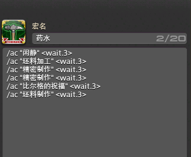
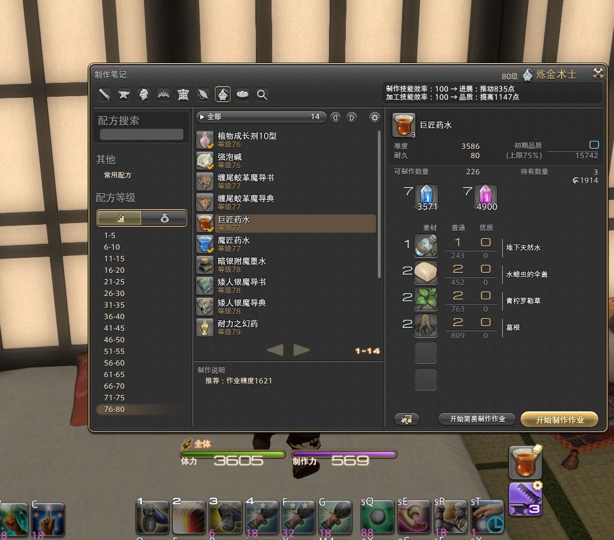

# Syrup-Solution

### A solution for  producing automatically in FFXIV(EP:Commanding Craftsman's Syrup)

This script is inspired by [theabhishek2511/housing (extreme).ahk](https://gist.github.com/theabhishek2511/ee86786b8a283d1f4f0479fbc0463570)

 > Please note that using 3rd party tools for automation is against the FFXIV Terms of Service.This script is provided only for educational purposes, and by downloading this script you agree that you are using this script at your own risk, and that I am not responsible for anything that happens to your account/game client/PC.

**The sleep times in this script may need to be changed depending on your latency and macros.**

**If you know what you are doing, you can also edit the script.**
***

#### How to use:
1. Install AutoHotkey
2. Save **Syrup.ahk** to somewhere accessible (download ZIP button, unzip etc)
3. Right click on the file, then choose **Run script** 
4. Modify the keybings like:

    
    
5. Modify your No.99 macro like:

    
6. Ensure that before starting the script, your game is set in keyboard mouse mode and your game window is active such like:

   
   
   **The production notebook window should be active**
7.  Press Delete to start the script. 
    Press Home to pause and resume the script.
    Press F1 to close the script altogether. You can also press Home to pause, then close AHK from the system tray.

AHK will send keypresses directly to the client as long as you start the script while the client is targeted.

After that, you can tab out and use your computer normally. This requires you to run the script as an administrator.

If the script ends up getting disturbed, just let it run for a while - eventually it should fall back in line.
